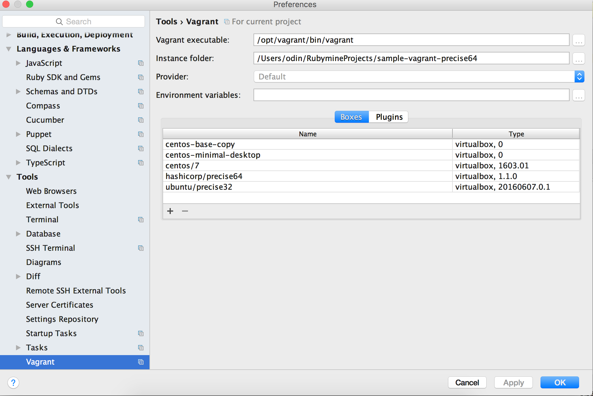
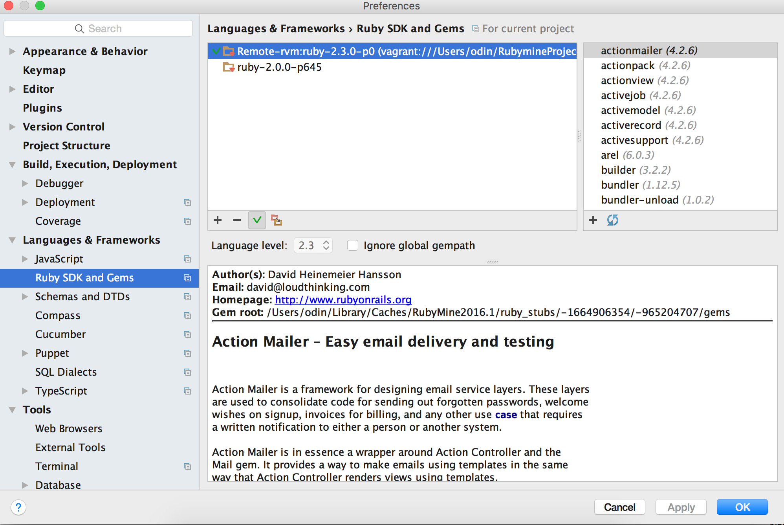

Steps
======
1 Start Rubymine
2 Clone repo
3 RubyMine/Preferences/Tools/Vagrant
4 Tools/Vagrant/Up
5 RubyMine/Preferences/Languages & Frameworks/RubySDK & Gems (it will take a while and some remote gems will appear)
6 Ensure path to ruby is rvm gem [1]
7 Make sure default is remote ruby now (see screenshot)
8 Run/Edit Configurations/Ruby SDK/Use Other SDK (select remote SDK)
9 Run/Run (or Debug for breakpoints, etc.)
10 Tools/Vagrant/Halt when done.

[1] http://stackoverflow.com/questions/27546471/rubymine-vagrant-rvm

