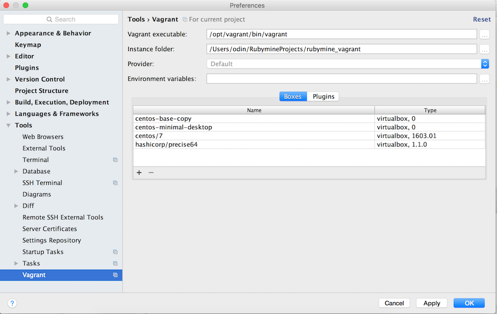
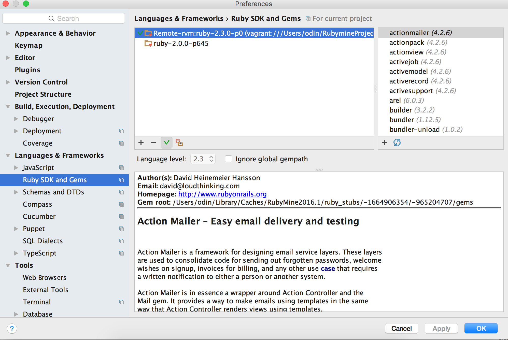
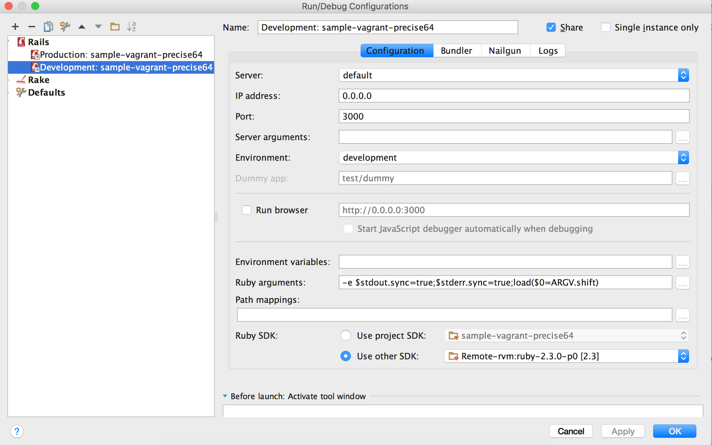

Steps
======
1. Start RubyMine
2. Clone repo
3. RubyMine/Preferences/Tools/Vagrant (see Figure 1)
4. Tools/Vagrant/Up
5. RubyMine/Preferences/Languages & Frameworks/RubySDK & Gems (it will take a while and some remote gems will appear)
6. Ensure path to remote ruby is remote rvm gem directory, not remote ruby. [1]
7. Make sure the default is remote ruby by clicking on checkbox (see Figure 2)
8. Run/Edit Configurations/Ruby SDK/Use Other SDK (Select remote SDK as in Figure 3.)
9. Run/Run (or Debug for debugging, etc. RubyMine would prompt for debase gem install. Click yes.)
10. Tools/Vagrant/Halt when done.

Screenshots
===========

Figure 1

Figure 2

Figure 3

Notes
=====
The Gemfile does not have a debugger, so RubyMine will alert you when
you try to run the debugger. Just click on "install debase" when prompted (or update your Gemfile).

RubyMine might complain about other missing gems also due to possible refresh issue.

References
==========
[1] http://stackoverflow.com/questions/27546471/rubymine-vagrant-rvm