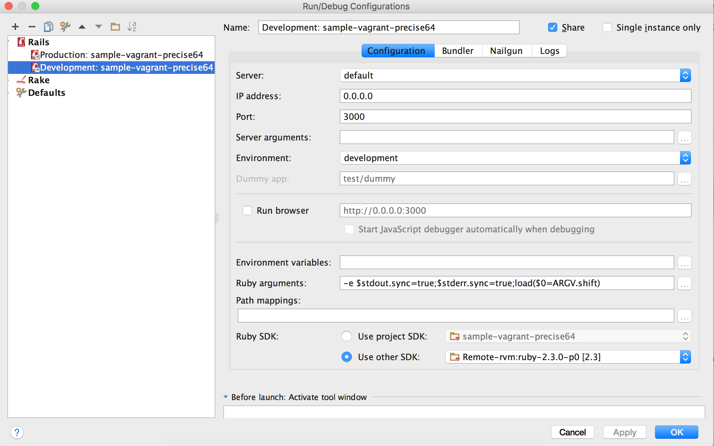

Steps
======
1 Start Rubymine
2 Clone repo
3 RubyMine/Preferences/Tools/Vagrant (see Figure 1)
4 Tools/Vagrant/Up
5 RubyMine/Preferences/Languages & Frameworks/RubySDK & Gems (it will take a while and some remote gems will appear)
6 Ensure path to ruby is rvm gem [1]
7 Make sure default is remote ruby now (see Figure 2)
8 Run/Edit Configurations/Ruby SDK/Use Other SDK (Select remote SDK. See Figure 3.)
9 Run/Run (or Debug for breakpoints, etc.)
10 Tools/Vagrant/Halt when done.

Screenshots
===========

Figure 1

Figure 2

Figure 3

Notes
=====
1 Install debase for debugging (RubyMine will alert you). Currently not in gem file.
2 RubyMine can complain about missing gems. Possible refresh issue (ignore for now).

References
==========
[1] http://stackoverflow.com/questions/27546471/rubymine-vagrant-rvm