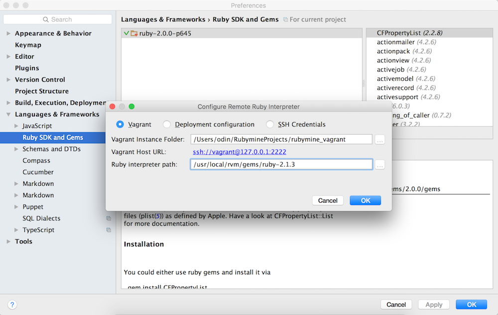
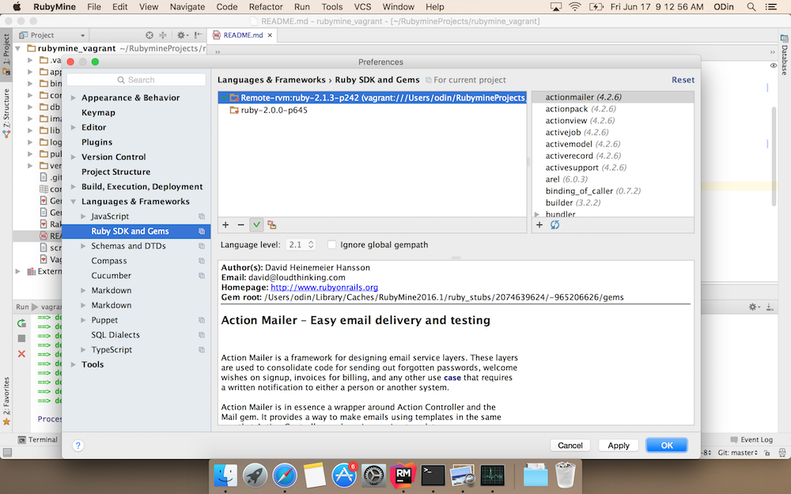
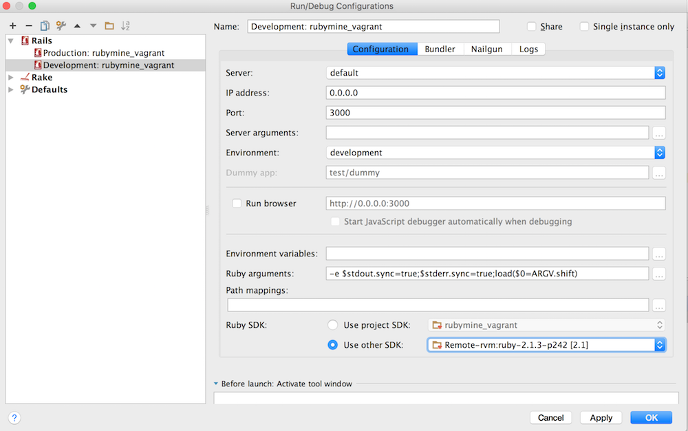
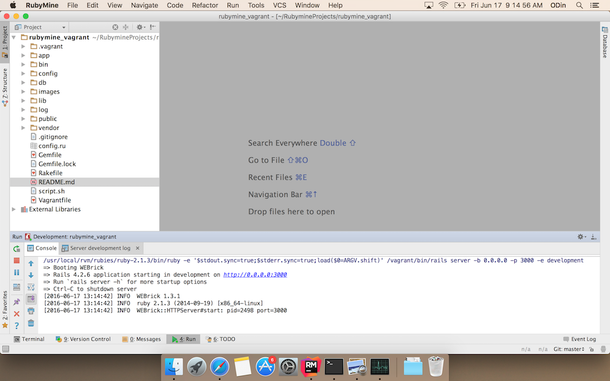

Introduction
============

The goal of this repo is to demonstrate how Vagrant and RubyMine work together. 
The Vagrant file makes use of a simple bash script in the repo to install and set up a custom stack (Ubuntu, Ruby 2.1.3, rvm, bundler, etc.). 

The repo contains a sample Rails application (that RubyMine syncs to the vagrant box), but the idea can easily be extended to
a more complex application.

Similarly, note that the prescribed set up does not intentionally include 
all of the relevant rvm/rails/scripting best practices. 

Steps
======
1. Start RubyMine
2. Clone this repo (from the RM dialog box or from VCS menu).
3. Go to: Tools/Vagrant/Up. Wait till the box starts (takes a while).
4. Go to: RubyMine/Preferences/Tools/Vagrant (see Figure 1) to confirm box appears.
5. Go to: RubyMine/Preferences/Languages & Frameworks/RubySDK & Gems. 
a. Add remote SDK.
   Just like Figure 2, ensure that the path to remote ruby is the rvm gem folder, not remote ruby. That is, the path should be: /usr/local/rvm/gems/ruby-2.1.3
b. Make sure the default SDK selected is remote ruby by clicking on checkbox (shift green check mark).
6. Go to: Run/Edit Configurations/Ruby SDK/Use Other SDK (Select remote SDK as in Figure 3.)
7. Go to: Run/Run (or Debug for debugging, etc. RubyMine would prompt for debase gem install. Click yes.)
7b. Confirm success by visiting localhost:3000/greetings/hello
8. Finally: Tools/Vagrant/Halt (when done).

You can also SSH into your box and create box snapshots (out of safety), etc.

Figure 1: Enabling Vagrant in RubyMine

Figure 2: Setting Remote Ruby

Figure 2b: Select Remote Ruby

Figure 3: Updating Run/Debug Configuration

Figure 4: Server Running

Notes
=====
The Gemfile does not have a debugger, so RubyMine will alert you when
you try to run the debugger. Just click on "install debase" when prompted (or update your Gemfile as you see fit).

If RubyMine cannot find your gems, it means that it's interacting with a wrong Ruby version on your box.